# Social Media Platform Architecture Diagram

```mermaid
graph TB
    %% User Layer
    subgraph "User Layer"
        U1[Web Browser]
        U2[Mobile Browser]
        U3[Desktop App]
    end

    %% CDN and Static Assets
    subgraph "CDN Layer"
        CDN[Cloudflare CDN]
        STATIC[Static Assets<br/>CSS/JS/Images]
        SEO[SEO Files<br/>robots.txt/sitemap.xml]
    end

    %% Load Balancer
    subgraph "Load Balancer"
        LB[Nginx Load Balancer<br/>SSL Termination<br/>Rate Limiting]
    end

    %% Frontend Application
    subgraph "Frontend Layer"
        FE[React Application<br/>Vite Build<br/>Port: 3000]
        
        subgraph "Frontend Components"
            AUTH_CTX[AuthContext<br/>JWT Management]
            PAGES[Pages<br/>HomeFeed/Profile/Search]
            COMP[Components<br/>OptimizedImage/SEOHead]
            UTILS[Utils<br/>Performance Monitor]
        end
        
        subgraph "State Management"
            REDIS[Redis Cache<br/>Session Store]
            LOCAL[Local Storage<br/>User Preferences]
        end
    end

    %% API Gateway
    subgraph "API Gateway"
        GW[API Gateway<br/>Authentication<br/>Rate Limiting<br/>CORS]
    end

    %% Backend Services
    subgraph "Backend Services"
        subgraph "Core Services"
            AUTH[Auth Service<br/>JWT Tokens<br/>Refresh Logic]
            USER[User Service<br/>Profile Management<br/>Follow System]
            POST[Post Service<br/>Content CRUD<br/>Search/Feed]
            UPLOAD[Upload Service<br/>Cloudinary Integration]
            NOTIF[Notification Service<br/>Real-time Events]
        end

        subgraph "Real-time Layer"
            SOCKET[Socket.io Server<br/>WebSocket Connections<br/>Room Management]
            EVENTS[Event Handlers<br/>Live Updates<br/>Typing Indicators]
        end
    end

    %% Database Layer
    subgraph "Database Layer"
        subgraph "Primary Database"
            MONGO[MongoDB Atlas<br/>Primary Replica<br/>Port: 27017]
            
            subgraph "Collections"
                USERS_COL[Users Collection<br/>Indexed: username/email]
                POSTS_COL[Posts Collection<br/>Indexed: userId/createdAt]
                COMMENTS_COL[Comments Collection<br/>Indexed: postId/createdAt]
                FOLLOW_COL[Follow Relations<br/>Indexed: follower/following]
            end
        end

        subgraph "Cache Layer"
            REDIS_DB[Redis Cluster<br/>API Response Cache<br/>Session Storage]
            MEMCACHED[Memcached<br/>Static Data Cache]
        end
    end

    %% External Services
    subgraph "External Services"
        CLOUDINARY[Cloudinary<br/>Image Storage<br/>Optimization]
        EMAIL[Email Service<br/>Notifications<br/>Password Reset]
        ANALYTICS[Analytics Service<br/>Performance Metrics<br/>User Behavior]
    end

    %% Monitoring and Logging
    subgraph "Monitoring Layer"
        LOGS[Centralized Logging<br/>Winston/ELK Stack]
        METRICS[Performance Metrics<br/>New Relic/DataDog]
        HEALTH[Health Checks<br/>Uptime Monitoring]
        ALERTS[Alert System<br/>Slack/Email Notifications]
    end

    %% Development and CI/CD
    subgraph "DevOps Layer"
        GITHUB[GitHub Repository<br/>Source Control]
        ACTIONS[GitHub Actions<br/>CI/CD Pipeline]
        DOCKER[Docker Registry<br/>Container Images]
        K8S[Kubernetes Cluster<br/>Orchestration]
    end

    %% Connections - User to CDN
    U1 --> CDN
    U2 --> CDN
    U3 --> CDN
    CDN --> STATIC
    CDN --> SEO

    %% Connections - User to Load Balancer
    U1 --> LB
    U2 --> LB
    U3 --> LB

    %% Load Balancer to Frontend
    LB --> FE

    %% Frontend Internal Connections
    FE --> AUTH_CTX
    FE --> PAGES
    FE --> COMP
    FE --> UTILS
    AUTH_CTX --> REDIS
    AUTH_CTX --> LOCAL

    %% Frontend to Backend
    FE --> GW
    GW --> AUTH
    GW --> USER
    GW --> POST
    GW --> UPLOAD
    GW --> NOTIF

    %% Real-time Connections
    FE -.-> SOCKET
    SOCKET --> EVENTS
    EVENTS -.-> FE

    %% Backend to Database
    AUTH --> MONGO
    USER --> MONGO
    POST --> MONGO
    UPLOAD --> CLOUDINARY
    NOTIF --> SOCKET

    %% Database Collections
    MONGO --> USERS_COL
    MONGO --> POSTS_COL
    MONGO --> COMMENTS_COL
    MONGO --> FOLLOW_COL

    %% Cache Layer
    AUTH --> REDIS_DB
    POST --> REDIS_DB
    USER --> MEMCACHED

    %% External Services
    UPLOAD --> CLOUDINARY
    NOTIF --> EMAIL
    UTILS --> ANALYTICS

    %% Monitoring Connections
    AUTH --> LOGS
    POST --> LOGS
    SOCKET --> LOGS
    LOGS --> METRICS
    METRICS --> HEALTH
    HEALTH --> ALERTS

    %% DevOps Connections
    GITHUB --> ACTIONS
    ACTIONS --> DOCKER
    DOCKER --> K8S
    K8S --> LB

    %% Styling
    classDef user fill:#e1f5fe,stroke:#01579b,stroke-width:2px
    classDef frontend fill:#f3e5f5,stroke:#4a148c,stroke-width:2px
    classDef backend fill:#e8f5e8,stroke:#1b5e20,stroke-width:2px
    classDef database fill:#fff3e0,stroke:#e65100,stroke-width:2px
    classDef external fill:#fce4ec,stroke:#880e4f,stroke-width:2px
    classDef monitoring fill:#f1f8e9,stroke:#33691e,stroke-width:2px
    classDef devops fill:#e3f2fd,stroke:#0d47a1,stroke-width:2px

    class U1,U2,U3 user
    class CDN,STATIC,SEO frontend
    class LB,GW,FE,AUTH_CTX,PAGES,COMP,UTILS,REDIS,LOCAL frontend
    class AUTH,USER,POST,UPLOAD,NOTIF,SOCKET,EVENTS backend
    class MONGO,USERS_COL,POSTS_COL,COMMENTS_COL,FOLLOW_COL,REDIS_DB,MEMCACHED database
    class CLOUDINARY,EMAIL,ANALYTICS external
    class LOGS,METRICS,HEALTH,ALERTS monitoring
    class GITHUB,ACTIONS,DOCKER,K8S devops
```

## Architecture Overview

### User Layer
- **Web Browser**: Desktop users accessing the platform
- **Mobile Browser**: Mobile users with responsive design
- **Desktop App**: Potential future electron application

### CDN Layer
- **Cloudflare CDN**: Global content delivery network
- **Static Assets**: Optimized CSS, JavaScript, and images
- **SEO Files**: robots.txt, sitemap.xml for search engines

### Frontend Layer
- **React Application**: Modern SPA with Vite build system
- **Components**: Modular React components with lazy loading
- **State Management**: Context API with local storage persistence
- **Performance**: OptimizedImage component and performance monitoring

### Backend Services
- **Auth Service**: JWT-based authentication with refresh tokens
- **User Service**: Profile management and social features
- **Post Service**: Content creation, search, and feed algorithms
- **Upload Service**: Cloudinary integration for media storage
- **Notification Service**: Real-time event handling

### Real-time Layer
- **Socket.io Server**: WebSocket connections for live updates
- **Event Handlers**: Typing indicators, notifications, live feed updates

### Database Layer
- **MongoDB Atlas**: Primary NoSQL database with replication
- **Collections**: Optimized schemas with proper indexing
- **Cache Layer**: Redis for session management and API caching

### External Services
- **Cloudinary**: Cloud-based image storage and optimization
- **Email Service**: Transactional emails and notifications
- **Analytics**: Performance tracking and user behavior analysis

### Monitoring Layer
- **Centralized Logging**: Structured logging with ELK stack
- **Performance Metrics**: Real-time monitoring with New Relic
- **Health Checks**: Application uptime and dependency monitoring
- **Alert System**: Automated notifications for issues

### DevOps Layer
- **GitHub Actions**: CI/CD pipeline with automated testing
- **Docker**: Containerized deployment with multi-stage builds
- **Kubernetes**: Orchestration for scalable deployments

## Data Flow

### Authentication Flow
1. User sends credentials to frontend
2. Frontend calls Auth Service via API Gateway
3. Auth Service validates against MongoDB
4. JWT tokens generated and stored in Redis
5. Tokens returned to frontend for future requests

### Post Creation Flow
1. User creates post with images
2. Images uploaded to Cloudinary via Upload Service
3. Post data saved to MongoDB via Post Service
4. Real-time notification sent via Socket.io
5. Feed updated for followers in real-time

### Real-time Communication
1. Users connect via Socket.io WebSocket
2. Join rooms for specific posts
3. Real-time events broadcast to relevant users
4. Typing indicators and live updates

## Performance Optimizations

### Frontend
- **Lazy Loading**: Components and images loaded on demand
- **Code Splitting**: Routes split into separate bundles
- **Caching**: Service worker and browser caching strategies
- **Image Optimization**: Progressive loading with WebP support

### Backend
- **Database Indexing**: Optimized queries with proper indexes
- **Response Compression**: Gzip compression for API responses
- **Connection Pooling**: Efficient database connection management
- **Caching**: Redis for frequently accessed data

### Infrastructure
- **CDN**: Global content delivery network
- **Load Balancing**: Distributed traffic management
- **Auto-scaling**: Dynamic resource allocation
- **Monitoring**: Real-time performance tracking

## Security Features

### Authentication
- **JWT Tokens**: Secure token-based authentication
- **Refresh Tokens**: Automatic token renewal
- **Password Hashing**: bcrypt with salt rounds
- **Session Management**: Redis-based session storage

### API Security
- **Rate Limiting**: Request throttling per IP
- **CORS**: Cross-origin resource sharing
- **Input Validation**: Joi schema validation
- **SQL Injection Prevention**: Mongoose ODM protection

### Infrastructure Security
- **SSL/TLS**: Encrypted communication
- **Firewall**: Network traffic filtering
- **Environment Variables**: Secure configuration management
- **Regular Updates**: Dependency security patches

## Scalability Considerations

### Horizontal Scaling
- **Load Balancers**: Multiple server instances
- **Database Sharding**: Distributed data storage
- **Microservices**: Service-oriented architecture
- **Container Orchestration**: Kubernetes deployment

### Performance Scaling
- **Caching Layers**: Multi-level caching strategy
- **CDN Integration**: Global content delivery
- **Database Optimization**: Query optimization and indexing
- **Real-time Scaling**: Socket.io connection management

This architecture supports a production-ready social media platform with high availability, scalability, and performance optimization.
